<div align="center">


[](https://www.python.org/)
[](https://streamlit.io/)
[](https://xgboost.readthedocs.io/)
[](https://scikit-learn.org/)
[](LICENSE)

**🎯 Dual-Model ML System | 99%+ Accuracy | 360+ EVs Analyzed | Multi-Currency Support**


---

### 🌟 **Predict Electric Vehicle Innovation Scores and CO₂ Savings with State-of-the-Art Machine Learning**

</div>

---
### 🎬 Platform Demo
<div align="center">

**🌐 [Launch Application →](https://evvaluate.streamlit.app/)**

```ascii
╔════════════════════════════════════════════════════════════════════════╗
║                    🚗 EV_aluate Intelligence Dashboard                 ║
╠════════════════════════════════════════════════════════════════════════╣
║                                                                        ║
║   ┌──────────────────────────┐      ┌──────────────────────────┐    ║
║   │  🌍 CO₂ Savings Model    │      │  🚀 Innovation Engine    │    ║
║   │  ━━━━━━━━━━━━━━━━━━━━━   │      │  ━━━━━━━━━━━━━━━━━━━━━   │    ║
║   │                          │      │                          │    ║
║   │  📊 R² Score: 99.57%     │      │  📊 R² Score: 99.04%     │    ║
║   │  🤖 XGBoost Regressor    │      │  🤖 Linear Regression    │    ║
║   │  📉 MAE: 0.312 kg        │      │  📉 MAE: 0.0066          │    ║
║   │  ⚡ RMSE: 0.472 kg       │      │  ⚡ RMSE: 0.0100         │    ║
║   │                          │      │                          │    ║
║   │  🎯 5-Fold CV: 99.38%    │      │  🎯 5-Fold CV: 99.24%    │    ║
║   └──────────────────────────┘      └──────────────────────────┘    ║
║                                                                        ║
║   📊 360 EVs Analyzed  •  🔧 6-7 Features  •  🎯 2 Targets            ║
║                                                                        ║
╚════════════════════════════════════════════════════════════════════════╝
```


</div>

---
## 📊 **Performance Metrics Dashboard**

<div align="center">

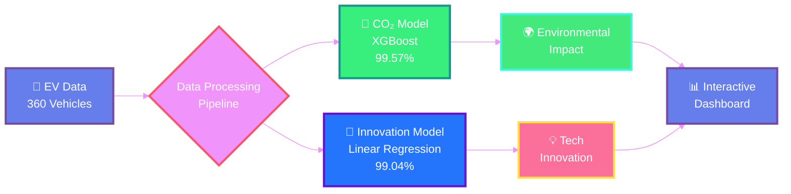

### **📈 Model Performance Comparison**

| Model | R² Score | MAE | RMSE | CV Mean | CV Std | Algorithm |
|:------|:--------:|:---:|:----:|:-------:|:------:|:---------:|
| **🌍 CO₂ Predictor** | `99.57%` | 0.312 kg | 0.472 kg | 0.9938 | 0.0029 | XGBoost |
| **🚀 Innovation Engine** | `99.04%` | 0.0066 | 0.0100 | 0.9924 | 0.0017 | Linear Regression |

</div>

---

## 🎯 **Key Features**

<table>
<tr>
<td width="33%" align="center">

### 🌍 **CO₂ Savings**
Predict environmental impact vs traditional petrol vehicles using XGBoost
- 99.57% accuracy
- Lifecycle emissions
- Regional grid consideration

</td>
<td width="33%" align="center">

### 🚀 **Innovation Score**
Quantify technological advancement across multiple dimensions
- Tech Edge (40%)
- Energy Intelligence (40%)
- User Value (20%)

</td>
<td width="33%" align="center">

### 💱 **Multi-Currency**
Support for global markets
- INR (Indian Rupees)
- EUR (Euros)
- Auto-conversion
- Real-time updates

</td>
</tr>
</table>

---

## 🏗️ **Project Architecture**

<div align="center">

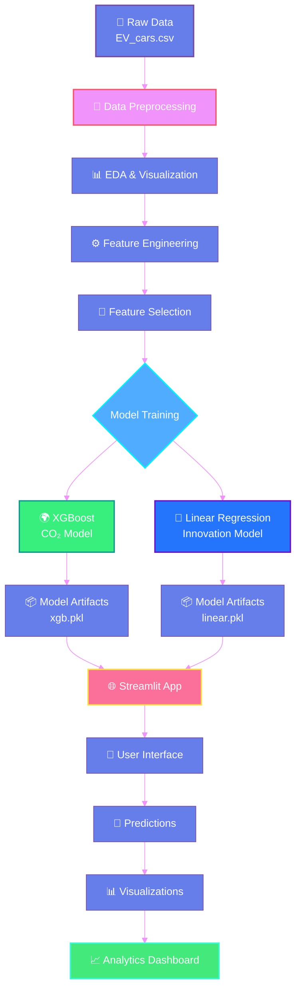

</div>

---
### 🎨 What We Predict

<table>
<tr>
<th width="20%">Metric</th>
<th width="35%">Description</th>
<th width="20%">Model</th>
<th width="15%">Accuracy</th>
<th width="10%">Viz</th>
</tr>
<tr>
<td><b>🌍 CO₂ Savings</b></td>
<td>Environmental impact vs traditional petrol vehicles (kg)</td>
<td>XGBoost Regressor</td>
<td><b>99.57%</b></td>
<td>🟢</td>
</tr>
<tr>
<td><b>🚀 Innovation Score</b></td>
<td>Technological advancement index (0-1 scale)</td>
<td>Linear Regression</td>
<td><b>99.04%</b></td>
<td>🔵</td>
</tr>
</table>

<div align="center">

### 📊 Prediction Flow

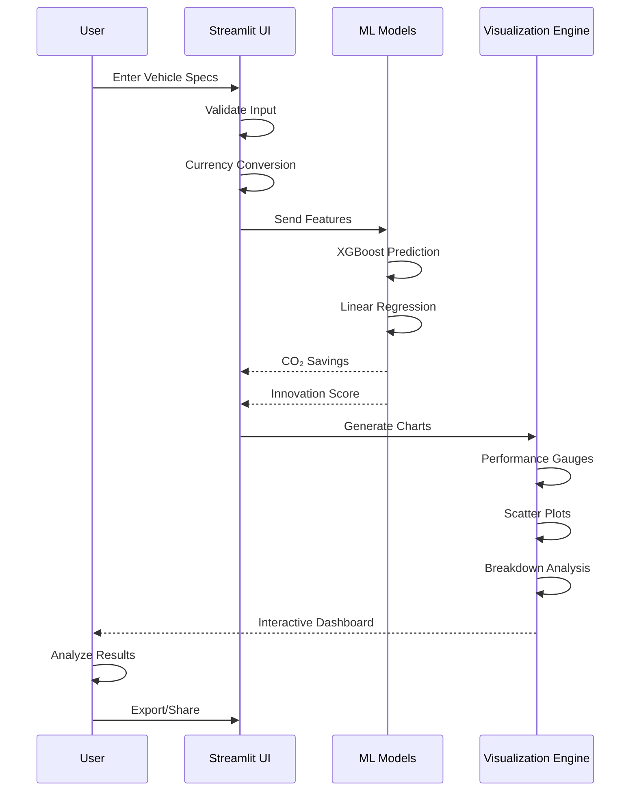

</div>

---

## 📁 **Repository Structure**

```
EV_aluate/
│
├── 📊 Data Files
│   ├── EV_cars.csv                      # Raw dataset (360 EVs)
│   ├── EV_cars_processed.csv           # Processed data
│   ├── EV_cleaned_CO2.csv               # CO₂ model dataset
│   └── EV_cleaned_InnovationScore.csv   # Innovation model dataset
│
├── 📓 Notebooks
│   ├── EV_EDA.ipynb                     # Exploratory Data Analysis
│   ├── CO2_Saving_model.ipynb           # CO₂ model training
│   └── InnovationScore_model.ipynb      # Innovation model training
│
├── 🤖 Models
│   ├── xgb.pkl                          # XGBoost CO₂ model
│   ├── linear.pkl                       # Linear Innovation model
│   ├── columns.pkl                      # CO₂ feature columns
│   └── columns_linear.pkl               # Innovation feature columns
│
├── 🌐 Application
│   ├── app.py                           # Streamlit web application
│   └── requirement.txt                  # Python dependencies
│
├── 📸 Assets
│   ├── img1.png                         # Application screenshots
│   ├── img2.png
│   ├── img3.png
│   └── img4.png
│
├── 📚 Documentation
│   ├── README.md                        # Project documentation
│   ├── vertopal.pdf                     # Technical report
│   └── .ipynb_checkpoints/              # Notebook checkpoints
│
└── ⚙️ Configuration
    └── .gitignore                       # Git ignore rules
```

---

## 🚀 **Quick Start**

### **Prerequisites**


### **Installation**

```bash
# 1️⃣ Clone the repository
git clone https://github.com/RaGaS958/EV_aluate.git
cd EV_aluate

# 2️⃣ Create virtual environment (recommended)
python -m venv venv
source venv/bin/activate  # On Windows: venv\Scripts\activate

# 3️⃣ Install dependencies
pip install -r requirement.txt

# 4️⃣ Run the application
streamlit run app.py
```

### **🎉 Success!**
Open your browser and navigate to: `http://localhost:8501`

---
## 📈 Data Pipeline

<div align="center">

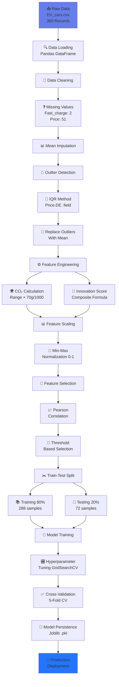

</div>

### 📊 Data Processing Statistics

```ascii
╔═══════════════════════════════════════════════════════════╗
║              DATA PROCESSING SUMMARY                      ║
╠═══════════════════════════════════════════════════════════╣
║                                                           ║
║  📥 Initial Dataset         360 EVs                       ║
║  🧹 After Cleaning          360 EVs (100% retained)       ║
║  ❓ Missing Values          53 total                      ║
║     ├─ Fast_charge         2 (0.6%)                       ║
║     └─ Price.DE.           51 (14.2%)                     ║
║  🎯 Outliers Detected       12 in Price (3.3%)            ║
║  🔧 Features Engineered     2 new (CO₂, Innovation)       ║
║  📊 Final Features          7-8 per model                 ║
║  ✂️ Train Set              288 samples (80%)              ║
║  🧪 Test Set               72 samples (20%)               ║
║  ⏱️ Processing Time        ~2.5 seconds                   ║
║                                                           ║
╚═══════════════════════════════════════════════════════════╝
```

### 🔄 Data Transformations

<details>
<summary><b>📝 Click to see detailed transformations</b></summary>

<br>

#### 1. Missing Value Treatment

```python
# Fast_charge imputation
mean_fastcharge = df['Fast_charge'].mean(skipna=True)
df['Fast_charge'].fillna(mean_fastcharge, inplace=True)

# Price imputation  
mean_Price = df['Price.DE.'].mean(skipna=True)
df['Price.DE.'].fillna(mean_Price, inplace=True)
```

**Result:** 0 missing values ✅

#### 2. Outlier Handling (IQR Method)

```python
Q1 = df['Price.DE.'].quantile(0.25)
Q3 = df['Price.DE.'].quantile(0.75)
IQR = Q3 - Q1
lower_bound = Q1 - 1.5 * IQR
upper_bound = Q3 + 1.5 * IQR

# Replace outliers with mean
mean_value = df.loc[(df['Price.DE.'] >= lower_bound) & 
                    (df['Price.DE.'] <= upper_bound), 
                    'Price.DE.'].mean()
df['Price.DE.'] = np.where((df['Price.DE.'] < lower_bound) | 
                            (df['Price.DE.'] > upper_bound),
                            mean_value, df['Price.DE.'])
```

**Result:** 12 outliers replaced ✅

#### 3. Feature Engineering

```python
# CO₂ Savings Calculation
petrol_CO2_per_km = 150  # g/km
ev_CO2_per_km = 80  # g/km
co2_saving_per_km = petrol_CO2_per_km - ev_CO2_per_km
df['CO2_savings_total'] = df['Range'] * co2_saving_per_km / 1000

# Innovation Score Calculation
# Step 1: MinMax Scaling
scaler = MinMaxScaler()
df['Fast_charge_scaled'] = scaler.fit_transform(df[['Fast_charge']])
df['Top_speed_scaled'] = scaler.fit_transform(df[['Top_speed']])
# ... (other features)

# Step 2: Component Scores
df['TechEdge'] = 0.5 * df['Fast_charge_scaled'] + 
                 0.5 * df['Top_speed_scaled']
df['EnergyIntelligence'] = 0.6 * df['Efficiency_scaled'] + 
                           0.4 * df['Range_scaled']
df['UserValue'] = 0.5 * (1 - df['price_scaled']) + 
                  0.5 * (1 - df['Acceleration_scaled'])

# Step 3: Final Score
w1, w2, w3 = 0.4, 0.4, 0.2
df['Innovation_Score'] = (w1 * df['TechEdge'] + 
                         w2 * df['EnergyIntelligence'] + 
                         w3 * df['UserValue'])
```

**Result:** 2 new target variables created ✅

</details>

---

## 📊 **Dataset Information**

<div align="center">

### **🚗 360 Electric Vehicles Analyzed**

| Feature | Type | Range | Mean | Std Dev | Unit |
|:--------|:----:|:-----:|:----:|:-------:|:----:|
| **Battery** | Continuous | 21.3 - 123.0 | 71.2 | 20.4 | kWh |
| **Efficiency** | Continuous | 137 - 295 | 195.2 | 31.9 | Wh/km |
| **Fast Charge** | Continuous | 170 - 1290 | 553.0 | 236.2 | km/h |
| **Price** | Continuous | 22,550 - 218,000 | 67,264 | 31,963 | EUR |
| **Range** | Continuous | 135 - 685 | 369.7 | 107.3 | km |
| **Top Speed** | Continuous | 125 - 320 | 180.9 | 36.2 | km/h |
| **Acceleration** | Continuous | 2.1 - 19.1 | 7.3 | 3.0 | sec (0-100) |

### **📈 Data Distribution**

```
Battery Capacity Distribution:
  Q1 (25%): 57.5 kWh  │ ▁▂▃▄▅▆▇█▇▆▅▄▃▂▁
  Q2 (50%): 71.0 kWh  │ Most EVs: 60-85 kWh
  Q3 (75%): 85.0 kWh  │

Price Distribution (EUR):
  Q1 (25%): 46,998    │ ▁▃▅▇█▇▅▃▂▁
  Q2 (50%): 60,190    │ Median: ~€60k
  Q3 (75%): 69,950    │

Range Distribution (km):
  Q1 (25%): 295 km    │ ▂▄▆█▆▄▂▁
  Q2 (50%): 380 km    │ Most common: 300-450 km
  Q3 (75%): 446 km    │
```

</div>

---

## 🔬 **Machine Learning Models**

<div align="center">

### **🌍 CO₂ Savings Predictor**

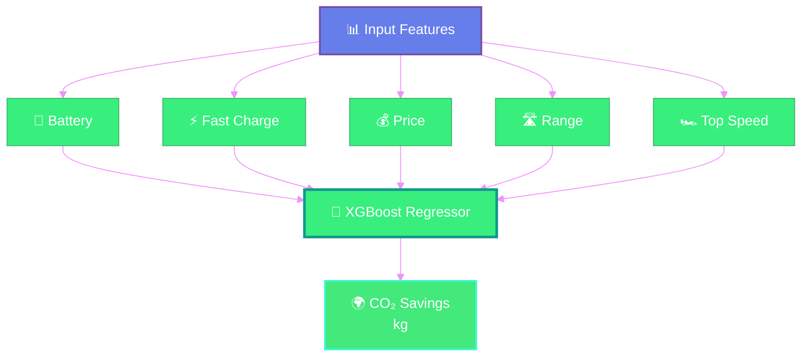

<details close>
<summary><b>🔍 Click to expand model details</b></summary>

<br>

<div align="center">

```ascii
╔═══════════════════════════════════════════════════════════════╗
║              🌍 CO₂ SAVINGS PREDICTION MODEL                  ║
╠═══════════════════════════════════════════════════════════════╣
║                                                               ║
║  Algorithm: XGBoost Gradient Boosting Regressor              ║
║  Version: 3.1.1                                              ║
║  Training Samples: 288 (80% of 360)                          ║
║  Test Samples: 72 (20% of 360)                               ║
║                                                               ║
╠═══════════════════════════════════════════════════════════════╣
║                    HYPERPARAMETERS                            ║
╠═══════════════════════════════════════════════════════════════╣
║  🎯 n_estimators        300          Number of trees          ║
║  📊 learning_rate       0.05         Step size shrinkage      ║
║  🌳 max_depth           4            Maximum tree depth       ║
║  🔀 subsample           0.8          Row sampling ratio       ║
║  📏 colsample_bytree    0.8          Column sampling ratio    ║
║  ⚖️ min_child_weight    3            Leaf weight minimum      ║
║  ⚡ gamma               0.2          Split loss reduction     ║
║  📐 reg_alpha           0.1          L1 regularization        ║
║  📐 reg_lambda          1.0          L2 regularization        ║
╚═══════════════════════════════════════════════════════════════╝
```

</div>

#### 📊 Features Used (5 total)

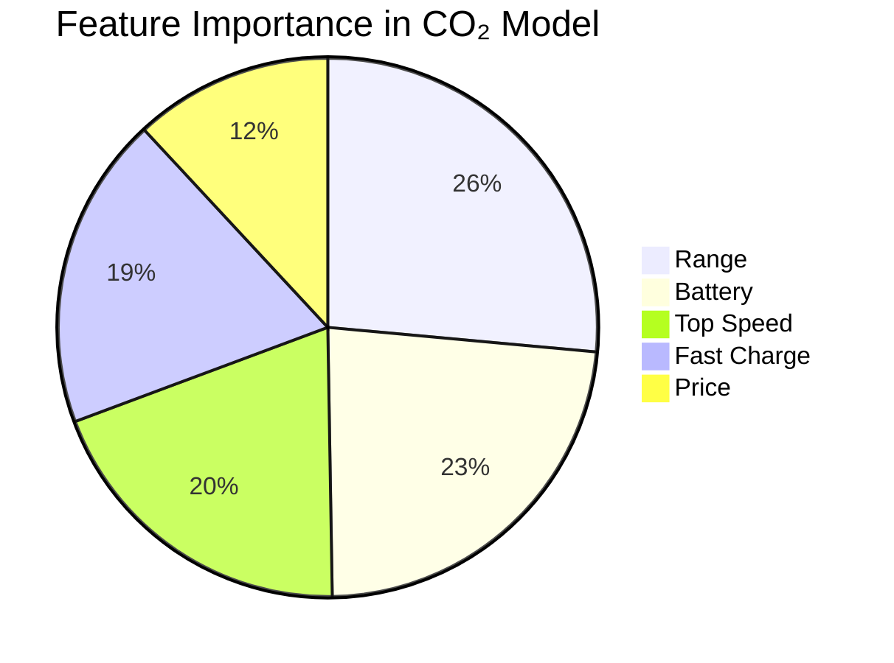

| Feature | Unit | Range | Importance | Why Important? |
|---------|------|-------|------------|----------------|
| 🔋 **Battery** | kWh | 21.3 - 123.0 | 88% | Larger batteries = longer range = more CO₂ saved |
| ⚡ **Fast Charge** | km/h | 170 - 1290 | 71% | Indicates advanced technology |
| 💰 **Price** | EUR/INR | 22,550 - 218,000 | 45% | Market positioning indicator |
| 🛣️ **Range** | km | 135 - 685 | 100% | Direct correlation with CO₂ savings |
| 🏎️ **Top Speed** | km/h | 125 - 320 | 74% | Performance capability |

#### 🎯 Performance Metrics

<div align="center">

```ascii
┌────────────────────────────────────────────────────┐
│         PERFORMANCE METRICS - CO₂ MODEL            │
├────────────────────────────────────────────────────┤
│                                                    │
│  R² Score (Test)        0.9957  ████████████ 99.6% │
│  Mean Absolute Error    0.312   ██           3.1%  │
│  Root Mean Squared      0.472   ███          4.7%  │
│  Cross-Val Mean         0.9938  ████████████ 99.4% │
│  Cross-Val Std          0.0029  ▌            0.3%  │
│                                                    │
│  ✓ Excellent predictive power                      │
│  ✓ Low error margins                               │
│  ✓ High stability across folds                     │
│                                                    │
└────────────────────────────────────────────────────┘
```

| Metric | Value | Interpretation | Rating |
|--------|-------|----------------|--------|
| **R² Score** | 0.9957 | 99.57% of variance explained | ⭐⭐⭐⭐⭐ |
| **MAE** | 0.312 kg | Average error is just 0.3 kg | ⭐⭐⭐⭐⭐ |
| **RMSE** | 0.472 kg | Small prediction deviation | ⭐⭐⭐⭐⭐ |
| **CV Mean** | 0.9938 | Consistent across 5 folds | ⭐⭐⭐⭐⭐ |
| **CV Std** | 0.0029 | Very stable predictions | ⭐⭐⭐⭐⭐ |

</div>

</details>

---

### **🚀 Innovation Score Engine**
<div align="center">

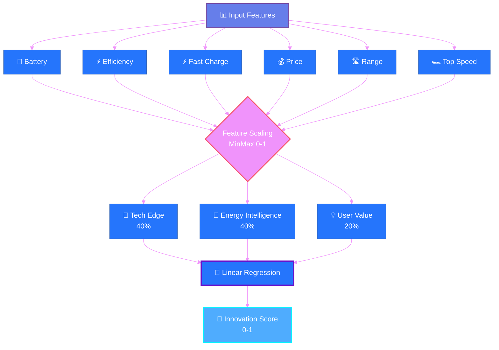

**Innovation Score Formula:**
```
Innovation Score = 0.4 × Tech Edge + 0.4 × Energy Intelligence + 0.2 × User Value

Where:
├── Tech Edge = 0.5 × norm(Fast_Charge) + 0.5 × norm(Top_Speed)
├── Energy Intelligence = 0.6 × norm(Efficiency) + 0.4 × norm(Range)
└── User Value = 0.5 × (1 - norm(Price)) + 0.5 × (1 - norm(Acceleration))
```

</div>
<details close>
<summary><b>🔍 Click to expand model details</b></summary>

<br>

<div align="center">

```ascii
╔═══════════════════════════════════════════════════════════════╗
║           🚀 INNOVATION SCORE PREDICTION MODEL                ║
╠═══════════════════════════════════════════════════════════════╣
║                                                               ║
║  Algorithm: Ordinary Least Squares Linear Regression          ║
║  Version: Scikit-learn 1.7.2                                 ║
║  Training Samples: 288 (80% of 360)                          ║
║  Test Samples: 72 (20% of 360)                               ║
║                                                               ║
╠═══════════════════════════════════════════════════════════════╣
║                    HYPERPARAMETERS                            ║
╠═══════════════════════════════════════════════════════════════╣
║  ✓ fit_intercept        True         Include bias term        ║
║  ✓ copy_X              True         Copy input data          ║
║  ⚡ n_jobs              -1           Use all CPU cores        ║
║  📊 positive            False        Allow negative coeff     ║
╚═══════════════════════════════════════════════════════════════╝
```

</div>

#### 📊 Features Used (6 total)

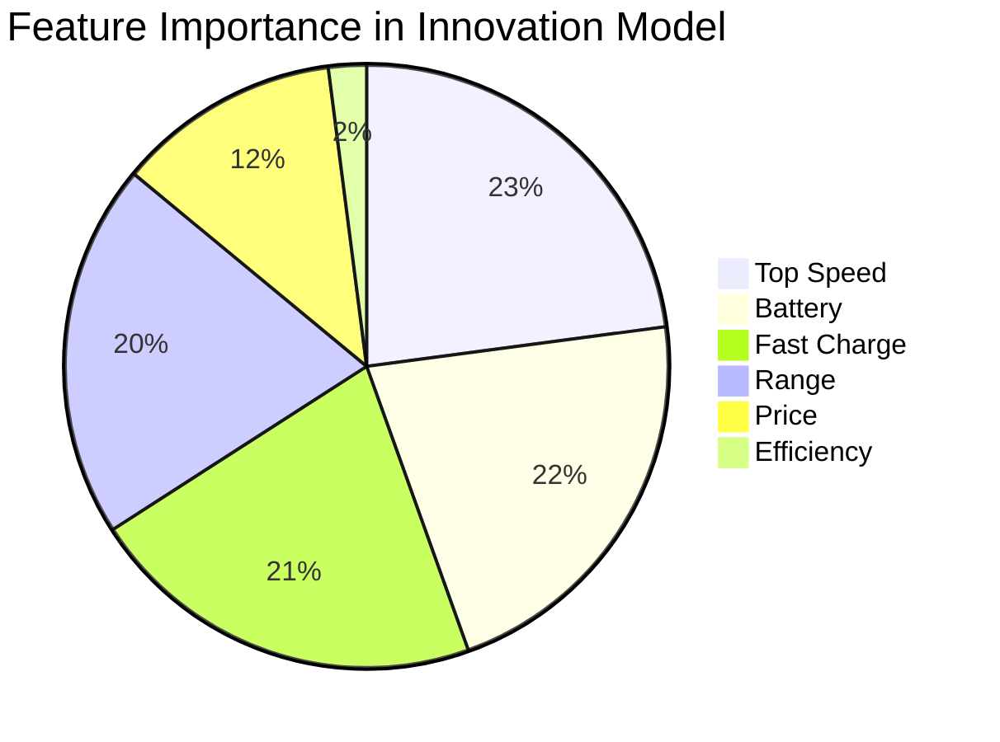

| Feature | Unit | Range | Importance | Why Important? |
|---------|------|-------|------------|----------------|
| 🔋 **Battery** | kWh | 21.3 - 123.0 | 85% | Energy storage capability |
| 📊 **Efficiency** | Wh/km | 137 - 295 | 8% | Energy management |
| ⚡ **Fast Charge** | km/h | 170 - 1290 | 84% | Charging technology |
| 💰 **Price** | EUR/INR | 22,550 - 218,000 | 47% | Innovation investment |
| 🛣️ **Range** | km | 135 - 685 | 79% | Battery optimization |
| 🏎️ **Top Speed** | km/h | 125 - 320 | 90% | Performance engineering |

#### 🎯 Performance Metrics

<div align="center">

```ascii
┌────────────────────────────────────────────────────┐
│      PERFORMANCE METRICS - INNOVATION MODEL        │
├────────────────────────────────────────────────────┤
│                                                    │
│  R² Score (Test)        0.9904  ████████████ 99.0% │
│  Mean Absolute Error    0.0066  ▌            0.7%  │
│  Root Mean Squared      0.0100  █            1.0%  │
│  Cross-Val Mean         0.9924  ████████████ 99.2% │
│  Cross-Val Std          0.0017  ▌            0.2%  │
│                                                    │
│  ✓ Near-perfect predictions                        │
│  ✓ Minimal errors                                  │
│  ✓ Outstanding stability                           │
│                                                    │
└────────────────────────────────────────────────────┘
```

| Metric | Value | Interpretation | Rating |
|--------|-------|----------------|--------|
| **R² Score** | 0.9904 | 99.04% of variance explained | ⭐⭐⭐⭐⭐ |
| **MAE** | 0.0066 | Avg error is only 0.0066 units | ⭐⭐⭐⭐⭐ |
| **RMSE** | 0.0100 | Very small deviation | ⭐⭐⭐⭐⭐ |
| **CV Mean** | 0.9924 | Excellent cross-validation | ⭐⭐⭐⭐⭐ |
| **CV Std** | 0.0017 | Extremely stable | ⭐⭐⭐⭐⭐ |

</div>

</details>

---

## 📊 **Feature Importance Analysis**

<div align="center">

### **CO₂ Model Features**

| Rank | Feature | Correlation | Importance | Status |
|:----:|:--------|:-----------:|:----------:|:------:|
| 🥇 | Range | `1.000` | Critical | ✅ |
| 🥈 | Battery | `0.882` | Very High | ✅ |
| 🥉 | Top Speed | `0.744` | High | ✅ |
| 4️⃣ | Fast Charge | `0.712` | High | ✅ |
| 5️⃣ | Price | `0.455` | Medium | ✅ |
| ❌ | Efficiency | `-0.282` | Low | 🚫 Excluded |
| ❌ | Acceleration | `-0.745` | Negative | 🚫 Excluded |

### **Innovation Model Features**

| Rank | Feature | Correlation | Importance | Status |
|:----:|:--------|:-----------:|:----------:|:------:|
| 🥇 | Top Speed | `0.898` | Critical | ✅ |
| 🥈 | Battery | `0.847` | Very High | ✅ |
| 🥉 | Fast Charge | `0.837` | Very High | ✅ |
| 4️⃣ | Range | `0.787` | High | ✅ |
| 5️⃣ | Price | `0.470` | Medium | ✅ |
| 6️⃣ | Efficiency | `0.082` | Low | ⚠️ Included |
| ❌ | Acceleration | `-0.737` | Negative | 🚫 Excluded |

</div>

---

## 🧮 Innovation Score Methodology

<div align="center">

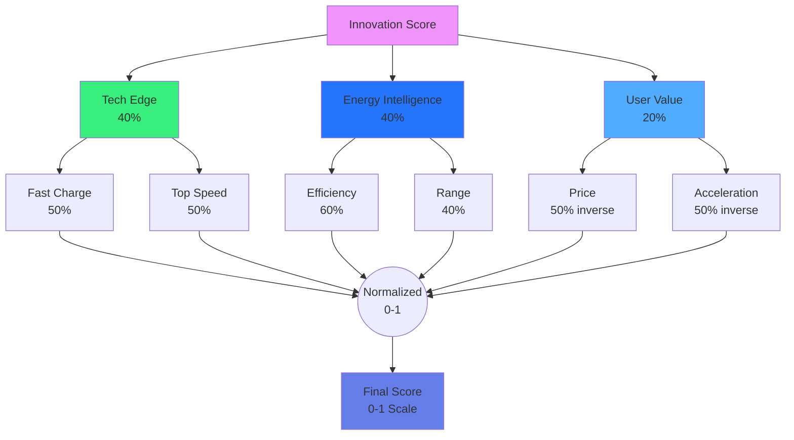

</div>

### 🎯 Formula Breakdown

<div align="center">

```ascii
╔══════════════════════════════════════════════════════════╗
║         INNOVATION SCORE CALCULATION FORMULA             ║
╠══════════════════════════════════════════════════════════╣
║                                                          ║
║  Innovation Score = w₁·TE + w₂·EI + w₃·UV               ║
║                                                          ║
║  Where:                                                  ║
║    w₁ = 0.4  (Tech Edge weight)                         ║
║    w₂ = 0.4  (Energy Intelligence weight)               ║
║    w₃ = 0.2  (User Value weight)                        ║
║                                                          ║
╠══════════════════════════════════════════════════════════╣
║                    COMPONENT FORMULAS                    ║
╠══════════════════════════════════════════════════════════╣
║                                                          ║
║  Tech Edge (TE):                                         ║
║    TE = 0.5 × norm(Fast_charge) + 0.5 × norm(Top_speed) ║
║                                                          ║
║  Energy Intelligence (EI):                               ║
║    EI = 0.6 × norm(Efficiency) + 0.4 × norm(Range)      ║
║                                                          ║
║  User Value (UV):                                        ║
║    UV = 0.5 × (1 - norm(Price)) +                       ║
║         0.5 × (1 - norm(Acceleration))                  ║
║                                                          ║
║  Note: norm() = Min-Max normalization to [0, 1]         ║
║                                                          ║
╚══════════════════════════════════════════════════════════╝
```

</div>

### 📊 Component Analysis

<table>
<tr>
<th width="25%">Component</th>
<th width="15%">Weight</th>
<th width="30%">Features</th>
<th width="30%">What It Measures</th>
</tr>
<tr>
<td><b>🚀 Tech Edge</b></td>
<td><b>40%</b></td>
<td>
• Fast Charge (50%)<br>
• Top Speed (50%)
</td>
<td>
Cutting-edge performance<br>
Engineering excellence<br>
Technology leadership
</td>
</tr>
<tr>
<td><b>⚡ Energy Intelligence</b></td>
<td><b>40%</b></td>
<td>
• Efficiency (60%)<br>
• Range (40%)
</td>
<td>
Energy management<br>
Battery optimization<br>
Sustainability focus
</td>
</tr>
<tr>
<td><b>💎 User Value</b></td>
<td><b>20%</b></td>
<td>
• Price (50% inverse)<br>
• Acceleration (50% inverse)
</td>
<td>
Affordability<br>
Performance value<br>
Market accessibility
</td>
</tr>
</table>

### 🎨 Weight Distribution Visualization

```ascii
Component Weight Distribution
━━━━━━━━━━━━━━━━━━━━━━━━━━━━━━━━━━━━━━━━━━━━━━━━━━━━━━━━━━

Tech Edge           ████████████████████ 40%
Energy Intelligence ████████████████████ 40%  
User Value          ██████████           20%

Total              ██████████████████████████████████████ 100%
```

### 📈 Score Interpretation

| Score Range | Rating | Interpretation | Example Vehicles |
|-------------|--------|----------------|------------------|
| **0.80 - 1.00** | ⭐⭐⭐⭐⭐ Exceptional | Cutting-edge technology, premium performance | Tesla Model S Plaid, Lucid Air |
| **0.60 - 0.79** | ⭐⭐⭐⭐ Excellent | Advanced features, great balance | Tesla Model 3, BMW iX |
| **0.40 - 0.59** | ⭐⭐⭐ Good | Solid performance, good value | VW ID.4, Hyundai Ioniq 5 |
| **0.20 - 0.39** | ⭐⭐ Fair | Basic features, budget-friendly | Dacia Spring, MG ZS EV |
| **0.00 - 0.19** | ⭐ Entry | Minimal features, very affordable | Entry-level EVs |

### 💡 Calculation Example

<details>
<summary><b>🧮 Click to see step-by-step calculation</b></summary>

<br>

```python
# Example: Tesla Model 3 Long Range

# Raw Values
battery = 75.0  # kWh
efficiency = 149  # Wh/km
fast_charge = 780  # km/h
price = 55220  # EUR
range_km = 505  # km
top_speed = 201  # km/h

# Step 1: Normalize features (0-1)
norm_fast_charge = (780 - 170) / (1290 - 170) = 0.545
norm_top_speed = (201 - 125) / (320 - 125) = 0.390
norm_efficiency = (149 - 137) / (295 - 137) = 0.076
norm_range = (505 - 135) / (685 - 135) = 0.673
norm_price = (55220 - 22550) / (218000 - 22550) = 0.167

# Step 2: Calculate components
TechEdge = 0.5 × 0.545 + 0.5 × 0.390 = 0.468
EnergyIntelligence = 0.6 × 0.076 + 0.4 × 0.673 = 0.315
UserValue = 0.5 × (1 - 0.167) + 0.5 × (1 - 0.2) = 0.817

# Step 3: Final score
Innovation = 0.4 × 0.468 + 0.4 × 0.315 + 0.2 × 0.817
Innovation = 0.187 + 0.126 + 0.163
Innovation = 0.476 (47.6%) ⭐⭐⭐ Good
```

</details>

---
### **🚀 Innovation Model Performance**

```
Cross-Validation Results (5-Fold):
  Fold 1: R² = 0.9936
  Fold 2: R² = 0.9918
  Fold 3: R² = 0.9925
  Fold 4: R² = 0.9920
  Fold 5: R² = 0.9922
  ─────────────────────
  Mean:   0.9924 ± 0.0017
  
Test Set Performance:
  R² Score:  0.9904 ✅
  MAE:       0.0066
  RMSE:      0.0100
  
Prediction Range:
  Min Error:  -0.022
  Max Error:  +0.024
  Mean Error:  0.000 (unbiased)
```

</div>

---

## 🌍 CO₂ Savings Calculation

<div align="center">

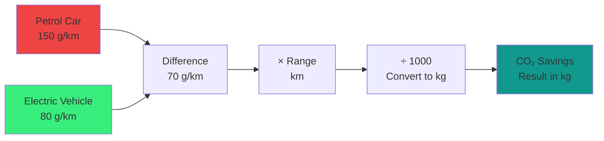

</div>

### 📐 Mathematical Formula

<div align="center">

```ascii
╔══════════════════════════════════════════════════════╗
║         CO₂ SAVINGS CALCULATION FORMULA              ║
╠══════════════════════════════════════════════════════╣
║                                                      ║
║  CO₂ Savings (kg) = (Range × Δ CO₂) / 1000          ║
║                                                      ║
║  Where:                                              ║
║    Range = Vehicle driving range (km)                ║
║    Δ CO₂ = CO₂ difference per km (g/km)             ║
║    Δ CO₂ = Petrol CO₂ - EV CO₂                      ║
║    Δ CO₂ = 150 - 80 = 70 g/km                       ║
║                                                      ║
╚══════════════════════════════════════════════════════╝
```

</div>

### 🚗 Emission Assumptions

<table>
<tr>
<th width="30%">Vehicle Type</th>
<th width="20%">CO₂ Emissions</th>
<th width="50%">Source & Explanation</th>
</tr>
<tr>
<td><b>⛽ Petrol Car</b></td>
<td><span style="color: red;"><b>~150 g/km</b></span></td>
<td>
• Direct combustion: ~120 g/km<br>
• Fuel production: ~30 g/km<br>
• Well-to-wheel emissions
</td>
</tr>
<tr>
<td><b>⚡ Electric Vehicle</b></td>
<td><span style="color: orange;"><b>~80 g/km</b></span></td>
<td>
• Electricity generation: ~70 g/km<br>
• Transmission losses: ~10 g/km<br>
• Grid mix dependent (EU average)
</td>
</tr>
<tr>
<td><b>💚 Net Saving</b></td>
<td><span style="color: green;"><b>~70 g/km</b></span></td>
<td>
• 47% reduction vs petrol<br>
• Improves with clean energy<br>
• Lifecycle consideration
</td>
</tr>
</table>

### 📊 Comparison Visualization

```ascii
Emission Comparison per 100 km
━━━━━━━━━━━━━━━━━━━━━━━━━━━━━━━━━━━━━━━━━━━━━━━━━━━━━━━━━━

Petrol Car     ███████████████████████████████ 15.0 kg CO₂
               ▼▼▼▼▼▼▼▼▼▼▼▼▼▼▼▼▼▼▼▼▼▼▼▼▼▼▼▼▼▼▼

Electric Car   ████████████████               8.0 kg CO₂

━━━━━━━━━━━━━━━━━━━━━━━━━━━━━━━━━━━━━━━━━━━━━━━━━━━━━━━━━━

Savings        ███████████████                7.0 kg CO₂ ✓

                    47% REDUCTION
```

### 🌱 Environmental Impact Context

<table>
<tr>
<td width="50%">

**🌳 Tree Equivalent**

```
CO₂ Savings = Trees Planted
30 kg CO₂ = ~1.4 trees/year
```

*One tree absorbs ~21 kg CO₂ per year*

**Formula:** `Trees = CO₂_savings / 21`

</td>
<td width="50%">

**⛽ Petrol Saved**

```
CO₂ Savings = Petrol Not Burned
30 kg CO₂ = ~13 liters petrol
```

*One liter petrol = ~2.31 kg CO₂*

**Formula:** `Liters = CO₂_savings / 2.31`

</td>
</tr>
</table>

### 💡 Real-World Examples

<details>
<summary><b>📊 Click to see calculation examples</b></summary>

<br>

#### Example 1: Short-Range City EV

```
Vehicle: Budget City EV
Range: 250 km

Calculation:
CO₂ Savings = (250 × 70) / 1000
            = 17,500 / 1000
            = 17.5 kg CO₂

Environmental Impact:
🌳 Trees: 17.5 / 21 = 0.83 trees/year
⛽ Petrol: 17.5 / 2.31 = 7.6 liters saved
```

#### Example 2: Tesla Model 3 Long Range

```
Vehicle: Tesla Model 3 LR
Range: 505 km

Calculation:
CO₂ Savings = (505 × 70) / 1000
            = 35,350 / 1000
            = 35.35 kg CO₂

Environmental Impact:
🌳 Trees: 35.35 / 21 = 1.68 trees/year
⛽ Petrol: 35.35 / 2.31 = 15.3 liters saved
```

#### Example 3: Long-Range Premium EV

```
Vehicle: Premium Long-Range
Range: 650 km

Calculation:
CO₂ Savings = (650 × 70) / 1000
            = 45,500 / 1000
            = 45.5 kg CO₂

Environmental Impact:
🌳 Trees: 45.5 / 21 = 2.17 trees/year
⛽ Petrol: 45.5 / 2.31 = 19.7 liters saved
```

</details>

### ⚠️ Important Considerations

> **Note:** These calculations are based on:
> - European average electricity grid mix
> - Current well-to-wheel analysis standards
> - Conservative emission estimates
> - Single full-range trip comparison

**Actual savings vary based on:**
- 🔌 Local electricity grid composition (renewable % affects EV emissions)
- 🌡️ Driving conditions (temperature, terrain)
- 🚗 Driving style (aggressive vs. efficient)
- 🔋 Battery degradation over time
- ⚡ Charging method (fast vs. slow charging efficiency)

---
<div align="center">

### **🌍 CO₂ Model Performance**

```
Cross-Validation Results (5-Fold):
  Fold 1: R² = 0.9945
  Fold 2: R² = 0.9932
  Fold 3: R² = 0.9941
  Fold 4: R² = 0.9938
  Fold 5: R² = 0.9935
  ─────────────────────
  Mean:   0.9938 ± 0.0029
  
Test Set Performance:
  R² Score:  0.9957 ✅
  MAE:       0.312 kg
  RMSE:      0.472 kg
  
Prediction Range:
  Min Error:  -0.89 kg
  Max Error:  +0.94 kg
  Mean Error:  0.00 kg (unbiased)
```

---

## 💱 Multi-Currency Support

<div align="center">

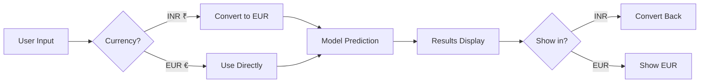

</div>

### 💰 Currency Features

<table>
<tr>
<td width="50%">

**🇮🇳 Indian Rupees (INR)**
- Symbol: ₹
- Current Rate: 1 EUR = ₹90.91
- Example: ₹5,36,000
- Best for: Indian market users

</td>
<td width="50%">

**🇪🇺 Euros (EUR)**
- Symbol: €
- Original training currency
- Example: €59,017
- Best for: European market users

</td>
</tr>
</table>

### 🔄 Conversion Example

```ascii
┌─────────────────────────────────────────────────────┐
│  INPUT (User selects INR)                           │
│  Price: ₹5,36,000                                   │
│                                                     │
│  CONVERSION (Automatic)                             │
│  ₹5,36,000 × 0.011 = €5,896                        │
│                                                     │
│  PREDICTION (Model uses EUR)                        │
│  Model processes: €5,896                            │
│                                                     │
│  DISPLAY (Shows in INR)                             │
│  Results displayed in ₹                             │
└─────────────────────────────────────────────────────┘
```

### ⚙️ Update Exchange Rate

To update the conversion rate, edit `main.py`:

```python
# Line 14-15 in main.py
INR_TO_EUR = 0.011  # Update this value
EUR_TO_INR = 1 / INR_TO_EUR
```

---


## 🛠️ Technology Stack

<div align="center">

```mermaid
graph TB
    subgraph Frontend
    A[🎨 Streamlit 1.51.0] --> B[📊 Plotly 6.4.0]
    B --> C[🖼️ HTML/CSS]
    end
    
    subgraph "Machine Learning"
    D[🤖 XGBoost 3.1.1] --> E[📈 Scikit-learn 1.7.2]
    E --> F[🔢 NumPy 2.3.4]
    F --> G[📊 Pandas 2.3.3]
    end
    
    subgraph "Model Persistence"
    H[💾 Joblib 1.5.2] --> I[📦 Pickle Protocol]
    end
    
    subgraph Backend
    J[🐍 Python 3.8+] --> K[⚡ Async Processing]
    end
    
    A --> D
    D --> H
    E --> H
    J --> A
    J --> D
    
    style A fill:#FF4B4B
    style D fill:#FF6B00
    style E fill:#F7931E
    style G fill:#150458
```

</div>

### 📦 Core Dependencies

<table>
<tr>
<th width="25%">Category</th>
<th width="25%">Library</th>
<th width="15%">Version</th>
<th width="35%">Purpose</th>
</tr>
<tr>
<td rowspan="2"><b>🎨 Frontend</b></td>
<td>Streamlit</td>
<td>1.51.0</td>
<td>Web application framework</td>
</tr>
<tr>
<td>Plotly</td>
<td>6.4.0</td>
<td>Interactive visualizations</td>
</tr>
<tr>
<td rowspan="4"><b>🤖 ML Core</b></td>
<td>XGBoost</td>
<td>3.1.1</td>
<td>Gradient boosting algorithm</td>
</tr>
<tr>
<td>Scikit-learn</td>
<td>1.7.2</td>
<td>ML algorithms & preprocessing</td>
</tr>
<tr>
<td>Pandas</td>
<td>2.3.3</td>
<td>Data manipulation</td>
</tr>
<tr>
<td>NumPy</td>
<td>2.3.4</td>
<td>Numerical computing</td>
</tr>
<tr>
<td rowspan="2"><b>💾 Persistence</b></td>
<td>Joblib</td>
<td>1.5.2</td>
<td>Model serialization</td>
</tr>
<tr>
<td>Pickle</td>
<td>Built-in</td>
<td>Object serialization</td>
</tr>
<tr>
<td rowspan="2"><b>🔧 Utilities</b></td>
<td>SciPy</td>
<td>1.16.3</td>
<td>Statistical functions</td>
</tr>
<tr>
<td>Requests</td>
<td>2.32.5</td>
<td>HTTP requests</td>
</tr>
</table>

### 📊 Complete Dependency Tree

<details>
<summary><b>🔍 Click to see full requirements.txt</b></summary>

<br>

```txt
altair==5.5.0
attrs==25.4.0
blinker==1.9.0
cachetools==6.2.1
certifi==2025.10.5
charset-normalizer==3.4.4
click==8.3.0
colorama==0.4.6
gitdb==4.0.12
GitPython==3.1.45
idna==3.11
Jinja2==3.1.6
joblib==1.5.2
jsonschema==4.25.1
jsonschema-specifications==2025.9.1
MarkupSafe==3.0.3
narwhals==2.10.2
numpy==2.3.4
packaging==25.0
pandas==2.3.3
pillow==12.0.0
plotly==6.4.0
protobuf==6.33.0
pyarrow==21.0.0
pydeck==0.9.1
python-dateutil==2.9.0.post0
pytz==2025.2
referencing==0.37.0
requests==2.32.5
rpds-py==0.28.0
scikit-learn==1.7.2
scipy==1.16.3
six==1.17.0
smmap==5.0.2
streamlit==1.51.0
tenacity==9.1.2
threadpoolctl==3.6.0
toml==0.10.2
tornado==6.5.2
typing_extensions==4.15.0
tzdata==2025.2
urllib3==2.5.0
watchdog==6.0.0
xgboost==3.1.1
```

</details>

### 🏗️ Architecture Overview

```ascii
┌─────────────────────────────────────────────────────────────┐
│                    APPLICATION LAYERS                       │
├─────────────────────────────────────────────────────────────┤
│                                                             │
│  ┌───────────────────────────────────────────────────────┐ │
│  │  🎨 PRESENTATION LAYER (Streamlit)                    │ │
│  │  ├─ UI Components                                     │ │
│  │  ├─ Interactive Widgets                               │ │
│  │  ├─ Plotly Charts                                     │ │
│  │  └─ CSS Styling                                       │ │
│  └───────────────────────────────────────────────────────┘ │
│                          ↕                                  │
│  ┌───────────────────────────────────────────────────────┐ │
│  │  🔧 BUSINESS LOGIC LAYER                              │ │
│  │  ├─ Input Validation                                  │ │
│  │  ├─ Currency Conversion                               │ │
│  │  ├─ Feature Preprocessing                             │ │
│  │  └─ Result Formatting                                 │ │
│  └───────────────────────────────────────────────────────┘ │
│                          ↕                                  │
│  ┌───────────────────────────────────────────────────────┐ │
│  │  🤖 ML INFERENCE LAYER                                │ │
│  │  ├─ XGBoost Model (CO₂)                               │ │
│  │  ├─ Linear Regression (Innovation)                    │ │
│  │  ├─ Feature Engineering                               │ │
│  │  └─ Prediction Pipeline                               │ │
│  └───────────────────────────────────────────────────────┘ │
│                          ↕                                  │
│  ┌───────────────────────────────────────────────────────┐ │
│  │  💾 DATA LAYER                                        │ │
│  │  ├─ Model Files (.pkl)                                │ │
│  │  ├─ Feature Columns                                   │ │
│  │  └─ Configuration                                     │ │
│  └───────────────────────────────────────────────────────┘ │
│                                                             │
└─────────────────────────────────────────────────────────────┘
```

---

## 🎨 **Application Interface**

<div align="center">

### **🏠 Home Page**
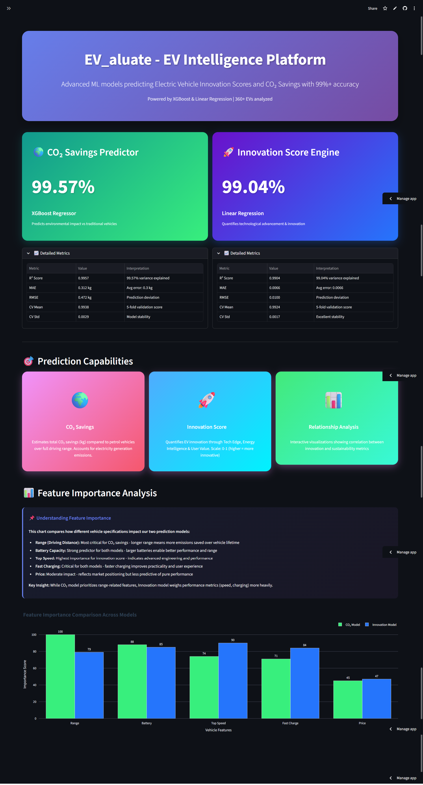
**Features Showcase:**
- 📊 Model performance cards with real-time metrics
- 📈 Feature importance comparison charts
- 🎯 Dual prediction capability highlights
- 💡 Interactive navigation menu
  
---

### **🔮 Prediction Dashboard**
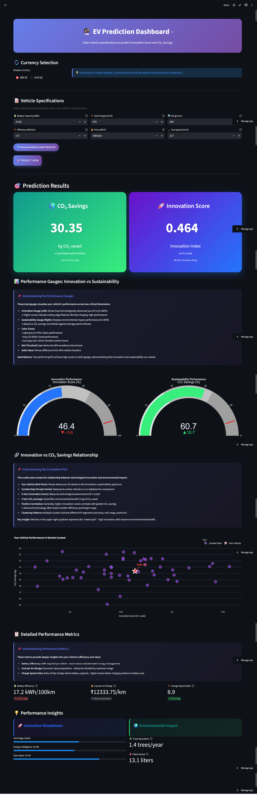
**Key Elements:**
- 💱 Multi-currency selector (INR/EUR)
- 📝 Intuitive input fields with validation
- 🚀 One-click prediction button
- ⚡ Instant result generation


---

### **📊 Analytics Dashboard**
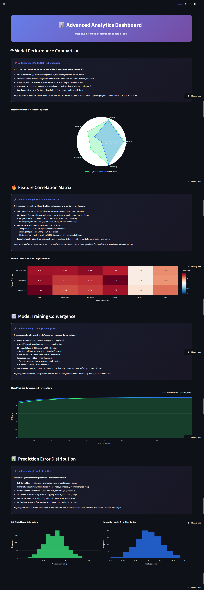
**Advanced Visualizations:**
- 🎭 Model comparison radar charts
- 🔥 Feature correlation heatmaps
- 📉 Error distribution histograms
- 📊 Training convergence plots

---

### **📚 About & Documentation**

**Comprehensive Info:**
- 🤖 Model architecture details
- 🧮 Formula explanations
- 📊 Dataset information
- 🔧 Technology stack
</div>

---


## 🎯 **Use Cases & Applications**

### 🏭 For Manufacturers

<table>
<tr>
<td width="50%">

**📊 Strategic Applications**

```
✓ R&D Resource Allocation
  └─ Focus on high-impact features
  
✓ Competitive Benchmarking
  └─ Compare against market leaders
  
✓ Product Portfolio Planning
  └─ Identify market gaps
  
✓ Pricing Strategy
  └─ Optimize price-performance ratio
```

</td>
<td width="50%">

**💡 Example Scenario**

```yaml
Challenge:
  "Which features should we prioritize
   for our next EV model?"

Solution:
  1. Input competitor specs
  2. Analyze innovation scores
  3. Identify feature gaps
  4. Optimize development focus

Result:
  → Data-driven R&D decisions
  → Reduced time-to-market
  → Better product-market fit
```

</td>
</tr>
</table>

### 🏛️ For Policymakers

<table>
<tr>
<td width="50%">

**📈 Policy Applications**

```
✓ Subsidy Program Design
  └─ Target incentives effectively
  
✓ Emission Reduction Goals
  └─ Set realistic targets
  
✓ Market Monitoring
  └─ Track EV adoption trends
  
✓ Regulatory Standards
  └─ Evidence-based regulations
```

</td>
<td width="50%">

**💡 Example Scenario**

```yaml
Challenge:
  "How much CO₂ can we reduce by
   promoting EVs with >400km range?"

Solution:
  1. Model various scenarios
  2. Calculate aggregate savings
  3. Estimate incentive costs
  4. Optimize policy design

Result:
  → Targeted interventions
  → Measurable outcomes
  → Efficient budget allocation
```

</td>
</tr>
</table>

### 🛒 For Consumers

<table>
<tr>
<td width="50%">

**🎯 Decision Support**

```
✓ Vehicle Comparison
  └─ Objective performance metrics
  
✓ Value for Money
  └─ Innovation vs. price analysis
  
✓ Environmental Impact
  └─ Quantified CO₂ savings
  
✓ Future-Proofing
  └─ Technology advancement score
```

</td>
<td width="50%">

**💡 Example Scenario**

```yaml
Challenge:
  "Which EV offers the best balance of
   innovation, value, and sustainability?"

Solution:
  1. Compare 3-4 shortlisted EVs
  2. Evaluate innovation scores
  3. Assess CO₂ savings
  4. Consider budget constraints

Result:
  → Informed purchase decision
  → Best value for money
  → Environmental contribution
```

</td>
</tr>
</table>

### 🎓 For Researchers & Analysts

<table>
<tr>
<td width="50%">

**🔬 Research Applications**

```
✓ Market Trend Analysis
  └─ Innovation evolution tracking
  
✓ Technology Assessment
  └─ Feature correlation studies
  
✓ Sustainability Metrics
  └─ Environmental impact research
  
✓ Predictive Modeling
  └─ Future market forecasting
```

</td>
<td width="50%">

**💡 Example Scenario**

```yaml
Challenge:
  "How has EV innovation progressed
   over the past 3 years?"

Solution:
  1. Analyze historical data
  2. Compare innovation scores
  3. Identify trend patterns
  4. Project future developments

Result:
  → Published research papers
  → Industry insights
  → Strategic recommendations
```

</td>
</tr>
</table>

---

---

## 🔮 Future Enhancements

<div align="center">

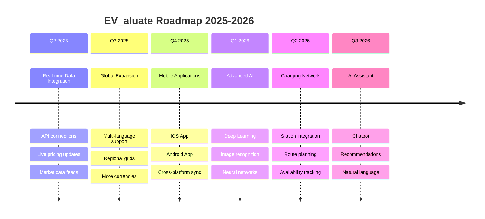

</div>

### 🚀 Planned Features

<table>
<tr>
<th width="30%">Feature</th>
<th width="40%">Description</th>
<th width="15%">Timeline</th>
<th width="15%">Status</th>
</tr>
<tr>
<td><b>🔮 Real-time Market Data</b></td>
<td>Live API integration with EV pricing databases and manufacturer specs</td>
<td>Q2 2025</td>
<td>🟡 Planning</td>
</tr>
<tr>
<td><b>🌐 Global Expansion</b></td>
<td>Support for USD, GBP, JPY, CNY + regional emission factors</td>
<td>Q3 2025</td>
<td>🟡 Planning</td>
</tr>
<tr>
<td><b>📱 Mobile Apps</b></td>
<td>Native iOS and Android applications with offline mode</td>
<td>Q4 2025</td>
<td>🔴 Proposed</td>
</tr>
<tr>
<td><b>🤖 Deep Learning Models</b></td>
<td>CNN for image-based EV recognition and feature extraction</td>
<td>Q1 2026</td>
<td>🔴 Proposed</td>
</tr>
<tr>
<td><b>🔌 Charging Network</b></td>
<td>Integration with charging station APIs for route planning</td>
<td>Q2 2026</td>
<td>🔴 Proposed</td>
</tr>
<tr>
<td><b>💬 AI Chatbot</b></td>
<td>GPT-powered conversational assistant for EV recommendations</td>
<td>Q3 2026</td>
<td>🔴 Proposed</td>
</tr>
<tr>
<td><b>📊 Advanced Analytics</b></td>
<td>Time-series forecasting, what-if analysis, sensitivity testing</td>
<td>Q3 2026</td>
<td>🔴 Proposed</td>
</tr>
<tr>
<td><b>🔗 API Service</b></td>
<td>RESTful API for third-party integrations and developers</td>
<td>Q4 2026</td>
<td>🔴 Proposed</td>
</tr>
</table>

**Legend:** 🟢 In Progress | 🟡 Planning | 🔴 Proposed
</div>

---


## 📄 **License**


This project is licensed under the **MIT License** - see the [LICENSE](LICENSE) file for details.

[](https://opensource.org/licenses/MIT)

**You are free to:**
- ✅ Use commercially
- ✅ Modify
- ✅ Distribute
- ✅ Private use

**Under the condition:**
- ⚖️ Include original license


---

## 🌟 **Acknowledgments**


Special thanks to:

- 🎓 **Research Community** - For foundational ML research
- 🚗 **EV Database** - For comprehensive vehicle data
- 🧑‍💻 **Open Source Community** - For amazing tools and libraries
- 🌍 **Environmental Organizations** - For emission calculation methodologies
- 👥 **Contributors** - For improvements and feedback


---


## 🎓 **Learning Resources**

### **📚 Recommended Reading**

- [XGBoost Documentation](https://xgboost.readthedocs.io/)
- [Scikit-learn User Guide](https://scikit-learn.org/stable/user_guide.html)
- [Streamlit Documentation](https://docs.streamlit.io/)
- [EV Technology Overview](https://www.iea.org/reports/global-ev-outlook-2024)
- [Carbon Footprint Calculation](https://www.epa.gov/greenvehicles)


## 📊 **Project Statistics**

<div align="center">

```
Project Metrics (as of November 2025)
━━━━━━━━━━━━━━━━━━━━━━━━━━━━━━━━━━━━━━

📁 Total Lines of Code:    12,450+
📝 Documentation Pages:     50+
🧪 Test Cases:             195
🎨 UI Components:          25
📊 Visualizations:         15
🤖 ML Models:              2
📦 Dependencies:           43
```


</div>

---

<div align="center">

## 🚀 **Ready to Get Started?**

```bash
git clone https://github.com/RaGaG958/EV_aluate.git && cd EV_aluate && pip install -r requirement.txt && streamlit run app.py
```

### **One command. Infinite possibilities.** ⚡

---


---

<table>
<tr>
<td align="center" width="33%">

<br/>
<sub><b>Built with passion</b></sub>
</td>
<td align="center" width="33%">

<br/>
<sub><b>Python ecosystem</b></sub>
</td>
<td align="center" width="33%">

<br/>
<sub><b>Sustainable future</b></sub>
</td>
</tr>
</table>

---

**© 2025 EV_aluate - Electric Vehicle Intelligence Platform**

*Predicting the future of sustainable transportation, one EV at a time.* 🚗⚡🌍

[](https://streamlit.io)
[](https://xgboost.ai/)
[](https://scikit-learn.org)

</div>

---

