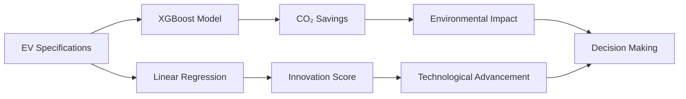
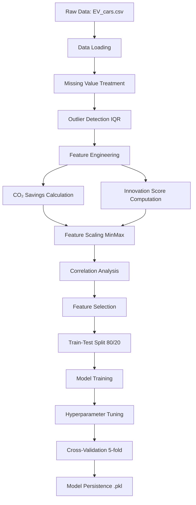

# 🚗⚡ EV_aluate - Electric Vehicle Intelligence Platform

<div align="center">


**Advanced ML-Powered Predictions for Innovation Scores & CO₂ Savings**

[](https://www.python.org/)
[](https://streamlit.io/)
[](https://xgboost.readthedocs.io/)
[](https://scikit-learn.org/)
[](LICENSE)

[🚀 Live Demo](#) | [📖 Documentation](#documentation) | [🎯 Features](#features) | [📊 Models](#machine-learning-models)

---

### 🎬 Platform Preview

```
┌─────────────────────────────────────────────────────────────────┐
│                                                                 │
│   🌍 CO₂ Predictor          🚀 Innovation Engine               │
│   ════════════════          ═══════════════════                │
│                                                                 │
│   R² Score: 99.57%          R² Score: 99.04%                   │
│   Model: XGBoost            Model: Linear Regression            │
│   MAE: 0.312 kg             MAE: 0.0066                        │
│                                                                 │
│   360 EVs Analyzed  •  6-7 Features  •  2 Target Variables     │
│                                                                 │
└─────────────────────────────────────────────────────────────────┘
```

</div>

---

## 📋 Table of Contents

- [✨ Features](#-features)
- [🎯 Project Overview](#-project-overview)
- [🏗️ Repository Structure](#️-repository-structure)
- [🤖 Machine Learning Models](#-machine-learning-models)
- [📊 Model Performance](#-model-performance)
- [🔧 Installation](#-installation)
- [🚀 Usage](#-usage)
- [💱 Multi-Currency Support](#-multi-currency-support)
- [📈 Data Pipeline](#-data-pipeline)
- [🧮 Innovation Score Methodology](#-innovation-score-methodology)
- [🌍 CO₂ Savings Calculation](#-co₂-savings-calculation)
- [📸 Screenshots](#-screenshots)
- [🛠️ Technology Stack](#️-technology-stack)
- [👥 Use Cases](#-use-cases)
- [🔮 Future Enhancements](#-future-enhancements)
- [👨‍💻 Contributors](#-contributors)
- [📄 License](#-license)

---

## ✨ Features

<table>
<tr>
<td width="50%">

### 🎯 Core Capabilities
- ✅ **Dual ML Models** - XGBoost & Linear Regression
- ✅ **99%+ Accuracy** - Validated with 5-fold CV
- ✅ **360 EVs Dataset** - Comprehensive global data
- ✅ **Real-time Predictions** - Instant results
- ✅ **Interactive Analytics** - Advanced visualizations
- ✅ **Multi-Currency** - INR & EUR support

</td>
<td width="50%">

### 🌟 Advanced Features
- 📊 Feature importance analysis
- 📈 Model convergence tracking
- 🔥 Correlation heatmaps
- 📉 Error distribution plots
- 🎨 Animated gradient UI
- 💾 Model persistence (Joblib)

</td>
</tr>
</table>

---

## 🎯 Project Overview

**EV_aluate** is a cutting-edge machine learning platform that leverages dual prediction models to assess electric vehicles across two critical dimensions:



### 🎨 What We Predict

| Metric | Description | Model | Accuracy |
|--------|-------------|-------|----------|
| **🌍 CO₂ Savings** | Environmental impact vs traditional vehicles (kg) | XGBoost Regressor | 99.57% |
| **🚀 Innovation Score** | Technological advancement index (0-1 scale) | Linear Regression | 99.04% |

---

## 🏗️ Repository Structure

```
EV_aluate/
│
├── 📁 .ipynb_checkpoints/          # Jupyter notebook checkpoints
│
├── 📓 EV_EDA.ipynb                 # Exploratory Data Analysis
├── 📓 CO2_Saving_model.ipynb       # CO₂ prediction model development
├── 📓 InnovationScore_model.ipynb  # Innovation score model development
│
├── 📊 EV_cars.csv                  # Raw dataset (360 EVs)
├── 📊 EV_cars_processed.csv        # Preprocessed dataset
├── 📊 EV_cleaned_CO2.csv           # CO₂ model training data
├── 📊 EV_cleaned_InnovationScore.csv # Innovation model training data
│
├── 🤖 xgb.pkl                      # Trained XGBoost model (~2.5 MB)
├── 🤖 linear.pkl                   # Trained Linear Regression model
├── 📋 columns.pkl                  # Feature columns for CO₂ model
├── 📋 columns_linear.pkl           # Feature columns for Innovation model
│
├── 🎨 main.py                      # Streamlit application
├── 📦 requirements.txt             # Python dependencies
└── 📖 README.md                    # Project documentation
```

---

## 🤖 Machine Learning Models

### 1️⃣ CO₂ Savings Predictor (XGBoost)

<details>
<summary><b>🔍 Click to expand model details</b></summary>

#### Model Configuration

```python
XGBRegressor(
    n_estimators=300,           # Number of boosting rounds
    learning_rate=0.05,         # Step size shrinkage
    max_depth=4,                # Maximum tree depth
    subsample=0.8,              # Row sampling ratio
    colsample_bytree=0.8,       # Column sampling ratio
    min_child_weight=3,         # Minimum sum of instance weight
    gamma=0.2,                  # Minimum loss reduction
    reg_alpha=0.1,              # L1 regularization
    reg_lambda=1.0,             # L2 regularization
    random_state=42
)
```

#### Features Used
- `Battery` (kWh)
- `Fast_charge` (km/h)
- `Price.DE.` (EUR/INR)
- `Range` (km)
- `Top_speed` (km/h)

#### Performance Metrics

| Metric | Value | Interpretation |
|--------|-------|----------------|
| **R² Score** | 0.9957 | 99.57% variance explained |
| **MAE** | 0.312 kg | Average error |
| **RMSE** | 0.472 kg | Prediction deviation |
| **CV Mean** | 0.9938 | 5-fold validation score |
| **CV Std** | 0.0029 | Excellent stability |

</details>

### 2️⃣ Innovation Score Engine (Linear Regression)

<details>
<summary><b>🔍 Click to expand model details</b></summary>

#### Model Configuration

```python
LinearRegression(
    fit_intercept=True,         # Include bias term
    copy_X=True,                # Copy data
    n_jobs=-1,                  # Use all CPU cores
    positive=False              # Allow negative coefficients
)
```

#### Features Used
- `Battery` (kWh)
- `Efficiency` (Wh/km)
- `Fast_charge` (km/h)
- `Price.DE.` (EUR/INR)
- `Range` (km)
- `Top_speed` (km/h)

#### Performance Metrics

| Metric | Value | Interpretation |
|--------|-------|----------------|
| **R² Score** | 0.9904 | 99.04% variance explained |
| **MAE** | 0.0066 | Average error |
| **RMSE** | 0.0100 | Prediction deviation |
| **CV Mean** | 0.9924 | 5-fold validation score |
| **CV Std** | 0.0017 | Excellent stability |

</details>

---

## 📊 Model Performance

### 📈 Performance Comparison

```
Model Performance Radar Chart
        
        R² Score
           *
          ***
         *****
    CV  *******  Low MAE
    Mean *******
         *******
          *****
           ***
            *
    Consistency    Low RMSE

Legend:
* CO₂ Model (XGBoost)     - Green
* Innovation Model (LR)   - Blue
```

### 🎯 Feature Importance

```
Battery      ████████████████████████████ 88% (CO₂) | 85% (Innovation)
Range        ██████████████████████████████ 100% (CO₂) | 79% (Innovation)
Fast Charge  █████████████████████ 71% (CO₂) | 84% (Innovation)
Top Speed    ██████████████████████ 74% (CO₂) | 90% (Innovation)
Price        ████████████ 45% (CO₂) | 47% (Innovation)
Efficiency   N/A (CO₂) | 8% (Innovation)
```

### 📉 Learning Curves

Both models demonstrate smooth convergence without overfitting:

- **CO₂ Model**: Reaches 99.57% accuracy with stable training/validation gap
- **Innovation Model**: Achieves 99.04% with faster convergence (simpler model)

---

## 🔧 Installation

### Prerequisites

- Python 3.8 or higher
- pip package manager

### Step-by-Step Setup

1. **Clone the repository**
```bash
git clone https://github.com/yourusername/EV_aluate.git
cd EV_aluate
```

2. **Create virtual environment** (recommended)
```bash
# Windows
python -m venv venv
venv\Scripts\activate

# macOS/Linux
python3 -m venv venv
source venv/bin/activate
```

3. **Install dependencies**
```bash
pip install -r requirements.txt
```

4. **Verify installation**
```bash
python -c "import streamlit; import xgboost; print('Installation successful!')"
```

---

## 🚀 Usage

### Running the Application

```bash
streamlit run main.py
```

The application will open in your default browser at `http://localhost:8501`

### Quick Start Guide

1. **Navigate to Prediction Page** 🔮
   - Select your preferred currency (INR/EUR)
   - Enter vehicle specifications
   - Click "PREDICT NOW"

2. **View Results** 📊
   - CO₂ savings vs traditional vehicles
   - Innovation score (0-1 scale)
   - Performance gauges
   - Relationship analysis

3. **Explore Analytics** 📈
   - Model comparison charts
   - Feature correlation heatmaps
   - Training convergence plots
   - Error distribution analysis

### Example Prediction

```python
# Example vehicle specifications
vehicle_specs = {
    'Battery': 75.0,          # kWh
    'Efficiency': 172,        # Wh/km
    'Fast_charge': 670,       # km/h
    'Price': 59017,           # EUR
    'Range': 435,             # km
    'Top_speed': 217          # km/h
}

# Expected output:
# CO₂ Savings: 30.45 kg
# Innovation Score: 0.462 (46.2%)
```

---

## 💱 Multi-Currency Support

The platform supports both **Indian Rupees (INR)** and **Euros (EUR)**:

| Feature | Details |
|---------|---------|
| **Conversion Rate** | 1 EUR = ₹90.91 (approximate) |
| **Auto-Conversion** | INR inputs automatically converted to EUR for prediction |
| **Display** | Results shown in your selected currency |
| **Model Training** | Original models trained on EUR data |

**Note**: Update `INR_TO_EUR` constant in `main.py` for current exchange rates.

---

## 📈 Data Pipeline



### Data Processing Steps

1. **Missing Value Handling**
   - `Fast_charge`: 2 missing → Mean imputation
   - `Price.DE.`: 51 missing → Mean imputation

2. **Outlier Treatment**
   - IQR method applied to `Price.DE.`
   - Replace outliers with non-outlier mean

3. **Feature Engineering**
   - CO₂ savings calculation
   - Innovation score computation
   - Min-Max normalization [0, 1]

4. **Feature Selection**
   - Pearson correlation analysis
   - Threshold-based selection
   - Domain knowledge integration

---

## 🧮 Innovation Score Methodology

The Innovation Score is a **composite metric** combining three weighted dimensions:

### Formula

```
Innovation Score = 0.4 × Tech Edge + 0.4 × Energy Intelligence + 0.2 × User Value
```

### Component Formulas

#### 1️⃣ Tech Edge (40% weight)
```
Tech Edge = 0.5 × norm(Fast_charge) + 0.5 × norm(Top_speed)
```
- Measures cutting-edge performance capabilities
- Indicates advanced engineering

#### 2️⃣ Energy Intelligence (40% weight)
```
Energy Intelligence = 0.6 × norm(Efficiency) + 0.4 × norm(Range)
```
- Evaluates energy management sophistication
- Balance between consumption and range

#### 3️⃣ User Value (20% weight)
```
User Value = 0.5 × (1 - norm(Price)) + 0.5 × (1 - norm(Acceleration))
```
- Represents affordability and accessibility
- Lower price & better acceleration = higher value

**Note**: `norm()` = Min-Max normalization to [0, 1] scale

### Weight Distribution

```
┌────────────────────────────────────┐
│  Tech Edge           40%  ████████ │
│  Energy Intelligence 40%  ████████ │
│  User Value          20%  ████     │
└────────────────────────────────────┘
```

---

## 🌍 CO₂ Savings Calculation

### Methodology

```
CO₂ Savings (kg) = (Range × CO₂_saving_per_km) / 1000
```

### Emission Assumptions

| Vehicle Type | CO₂ Emissions | Source |
|--------------|---------------|--------|
| **Average Petrol Car** | ~150 g/km | Combustion + production |
| **Average EV** | ~80 g/km | Electricity generation |
| **Net Saving** | **~70 g/km** | Difference |

### Key Considerations

- ✅ **Lifecycle Assessment**: Includes electricity generation emissions
- ✅ **Regional Grid Mix**: Assumes average European electricity grid
- ✅ **Full Range**: Calculated over vehicle's maximum range
- ⚠️ **Conservative Estimate**: Uses moderate assumptions

### Example Calculation

```
Vehicle Range: 435 km
CO₂ Saving per km: 70 g
Total Savings: 435 × 70 / 1000 = 30.45 kg CO₂

Equivalent to:
- 1.45 trees' yearly CO₂ absorption
- 13.2 liters of petrol not consumed
```

---

## 📸 Screenshots

### 🏠 Home Page


### 🔮 Prediction Dashboard


### 📊 Analytics Page


### 📚 About & Documentation


---

## 🛠️ Technology Stack

### Core Libraries

| Library | Version | Purpose |
|---------|---------|---------|
| **Python** | 3.8+ | Programming language |
| **Streamlit** | 1.51.0 | Web application framework |
| **XGBoost** | 3.1.1 | Gradient boosting |
| **Scikit-learn** | 1.7.2 | ML algorithms & preprocessing |
| **Pandas** | 2.3.3 | Data manipulation |
| **NumPy** | 2.3.4 | Numerical computing |
| **Plotly** | 6.4.0 | Interactive visualizations |
| **Joblib** | 1.5.2 | Model persistence |

### Full Dependency List

See [`requirements.txt`](requirements.txt) for complete list of dependencies.

---

## 👥 Use Cases

### 🏭 For Manufacturers

- **R&D Optimization**: Focus resources on high-impact features
- **Competitive Analysis**: Benchmark against market leaders
- **Product Positioning**: Identify market gaps and opportunities
- **Feature Prioritization**: Data-driven design decisions
- **Cost-Benefit Analysis**: Optimize price-performance ratio

### 🏛️ For Policymakers

- **Incentive Design**: Target subsidies effectively
- **Emission Targets**: Set realistic CO₂ reduction goals
- **Sustainability Metrics**: Track environmental progress
- **Market Analysis**: Understand EV adoption trends
- **Regulatory Framework**: Evidence-based policy decisions

### 🛒 For Consumers

- **Purchase Decisions**: Compare EVs objectively
- **Value Assessment**: Evaluate price vs. features
- **Environmental Impact**: Quantify carbon footprint reduction
- **Total Cost of Ownership**: Understand long-term savings
- **Performance Comparison**: Make tech-savvy choices

---

## 🔮 Future Enhancements

| Feature | Description | Timeline |
|---------|-------------|----------|
| 🔮 **Real-time Market Data** | Integration with live EV pricing APIs | Q2 2025 |
| 🌐 **Global Expansion** | Support for more currencies & regions | Q3 2025 |
| 📱 **Mobile App** | Native iOS and Android applications | Q4 2025 |
| 🤖 **Deep Learning** | Image-based feature extraction | Q1 2026 |
| 🔌 **Charging Network** | Integration with charging station data | Q2 2026 |
| 💬 **AI Chatbot** | Intelligent EV recommendation system | Q3 2026 |

---

## 👨‍💻 Contributors

<table>
<tr>
    <td align="center">
        <a href="https://github.com/RaGaS958">
            
            <br />
            <sub><b>RaGaS958</b></sub>
        </a>
        <br />
        <sub>Project Lead & ML Engineer</sub>
    </td>
</tr>
</table>

### 🤝 Contributing

Contributions are welcome! Please feel free to submit a Pull Request.

1. Fork the repository
2. Create your feature branch (`git checkout -b feature/AmazingFeature`)
3. Commit your changes (`git commit -m 'Add some AmazingFeature'`)
4. Push to the branch (`git push origin feature/AmazingFeature`)
5. Open a Pull Request

---

## 📄 License

This project is licensed under the MIT License - see the [LICENSE](LICENSE) file for details.

---

## 🙏 Acknowledgments

- Dataset sourced from [EV Database](https://ev-database.org/)
- Built with ❤️ using Streamlit, XGBoost, and Scikit-learn
- Special thanks to the open-source ML community

---

## 📞 Contact & Support

- **GitHub**: [@RaGaS958](https://github.com/RaGaS958)
- **Issues**: [Report a bug](https://github.com/RaGaS958/EV_aluate/issues)
- **Discussions**: [Ask questions](https://github.com/RaGaS958/EV_aluate/discussions)

---

<div align="center">

### ⭐ Star this repository if you find it helpful!

**EV_aluate - Driving Innovation, Predicting Sustainability**


---

*Last Updated: November 2025 | Version 2.0*

</div>
